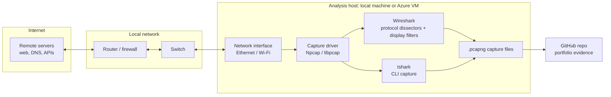
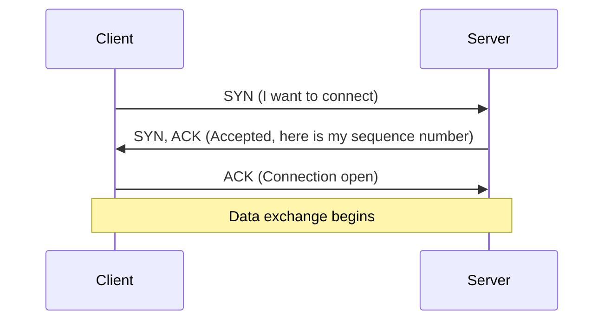

# Lab 2: Wireshark & Network Analysis

> Capturing, filtering, and interpreting live network traffic to diagnose connectivity issues and spot security risks at the packet level.


---

## Table of Contents

1. [Overview](#overview)
2. [Architecture](#architecture)
3. [The Business Problem](#the-business-problem)
4. [Key Concepts](#key-concepts)
5. [Prerequisites](#prerequisites)
6. [Setup: Install Wireshark](#setup-install-wireshark)
7. [Your First Capture](#your-first-capture)
8. [Essential Display Filters](#essential-display-filters)
9. [Guided Exercises](#guided-exercises)
10. [Saving and Exporting Captures](#saving-and-exporting-captures)
11. [Verification Checklist](#verification-checklist)
12. [Security Considerations](#security-considerations)
13. [Cloud Relevance](#cloud-relevance)
14. [Evidence and Captures](#evidence-and-captures)
15. [Key Takeaways](#key-takeaways)
16. [Cleanup](#cleanup)

---

## Overview

| Field | Value |
|---|---|
| **Certification alignment** | CompTIA Network+, Security+, CySA+ |
| **Tooling** | Wireshark (free, open source, no account required) |
| **Environment** | Local machine or Azure VM |
| **Time to complete** | 2-4 hours across multiple sessions |
| **Estimated cost** | $0 |
| **Role relevance** | Network Engineer, SOC Analyst, Cloud Security Engineer, Incident Responder |

### Objectives

By the end of this lab I can:

- Capture live traffic from a network interface
- Apply display filters to isolate the handful of packets that matter in a large capture
- Recognise a healthy TCP three-way handshake versus a failed one
- Identify DNS queries and responses and match them by transaction ID
- Demonstrate why unencrypted HTTP exposes credentials
- Reconstruct a full conversation between two hosts with TCP stream following
- Save, export, and re-open captures as `.pcapng` evidence

---

## Architecture

### How Wireshark captures traffic

Traffic flows from the internet through the local network to the host's network interface. A capture driver (Npcap on Windows, libpcap on macOS and Linux) hands copies of those frames to Wireshark, which decodes them layer by layer. Wireshark observes traffic; it does not sit inline or alter it.



### What a normal TCP connection looks like on the wire



A `SYN` with no `SYN, ACK` means the server is unreachable or the connection was filtered. A `RST` means the connection was refused or forcibly closed.

### Capture filters vs. display filters

| Type | Applied | Effect | Used in this lab |
|---|---|---|---|
| Capture filter | Before capture | Limits what is recorded; discarded packets are gone | No |
| Display filter | After capture | Limits what is shown; the full capture stays intact | **Yes** |

Display filters let me look at the same capture through different lenses without re-capturing.

---

## The Business Problem

Networks carry everything an organisation produces: email, database queries, credentials, file transfers, API calls. When a service is unreachable, performance degrades, or a security alert fires, the network is almost always involved. Packets are the ground truth. Wireshark inspects them at every layer, from the physical frame up to the application payload.

| Role | How this lab applies |
|---|---|
| Network Engineer | Diagnose connectivity issues by seeing exactly where packets are dropped or delayed |
| SOC Analyst | Identify malicious traffic patterns and extract indicators of compromise from captures |
| Cloud Security Engineer | The mental model transfers directly to Azure Network Watcher and VPC flow logs |
| Help Desk | Prove whether a reported network issue is real and whether it is client-side or server-side |

---

## Key Concepts

<details>
<summary><strong>What is a packet?</strong></summary>

A packet is a small unit of data. Loading a web page or sending an email splits the data into many packets. Each has a **header** (source IP, destination IP, port) and a **payload** (the actual data). Packets travel independently, may take different routes, and are reassembled at the destination. Wireshark shows each one individually.
</details>

<details>
<summary><strong>What is a network protocol?</strong></summary>

A protocol is a set of rules for formatting and transmitting data. DNS resolves names to IP addresses, HTTP transfers web content, TCP provides reliable delivery, and ICMP supports ping and diagnostics. Each has its own port and packet structure, which is why filtering by protocol is so effective.
</details>

<details>
<summary><strong>What is the TCP three-way handshake?</strong></summary>

Before exchanging data over TCP, two hosts set up a connection in three steps:

1. **SYN**: the client says "I want to connect."
2. **SYN-ACK**: the server says "Request received, here is my acknowledgement."
3. **ACK**: the client says "Confirmed, ready to send data."

A SYN with no SYN-ACK is one of the most useful signals when diagnosing connectivity problems.
</details>

<details>
<summary><strong>What is DNS?</strong></summary>

DNS translates names like `google.com` into IP addresses. A DNS query happens before almost every network action, so broken DNS breaks nearly everything. An **A record** maps a name to an IPv4 address (record type 1 in Wireshark). Other types include AAAA (IPv6), MX (mail), and CNAME (alias).
</details>

<details>
<summary><strong>HTTP vs. HTTPS</strong></summary>

HTTP is unencrypted: anyone who can see the traffic can read requests and responses, including credentials submitted in forms. HTTPS wraps HTTP in TLS so captured packets cannot be read. This lab demonstrates cleartext credentials over HTTP to show why HTTPS is the standard.
</details>

<details>
<summary><strong>What is promiscuous mode?</strong></summary>

Normally a NIC only accepts frames addressed to its own machine. In promiscuous mode it accepts every frame on the segment. Wireshark enables this automatically. On modern switched networks I mostly see my own traffic plus broadcast traffic; seeing other hosts' traffic requires a hub or port mirroring.
</details>

---

## Prerequisites

- A Windows, macOS, or Linux machine (or an Azure VM) where I have permission to capture traffic
- Administrator or root rights to install the capture driver
- A web browser and a terminal
- **Authorisation:** I only capture on networks and systems I own or have explicit permission to analyse

---

## Setup: Install Wireshark

Download the installer from [wireshark.org/download.html](https://www.wireshark.org/download.html). No account, trial, or licence is needed.

| OS | Installer | Notes |
|---|---|---|
| Windows | x64 installer (`.exe`) | Accept defaults. **Install Npcap when prompted**; it is required to capture packets |
| macOS | Arm or Intel (`.dmg`) | Allow **ChmodBPF** if prompted; it grants access to network interfaces |
| Linux | Package manager | `sudo apt install wireshark` on Ubuntu/Debian |

On Linux, add your user to the `wireshark` group so you can capture without running as root (log out and back in afterwards):

```bash
sudo usermod -aG wireshark $USER

# Verify the install
wireshark --version
```

---

## Your First Capture

1. Open Wireshark. The welcome screen lists interfaces with live activity graphs.
2. Double-click the active interface (Ethernet or Wi-Fi, whichever shows the most activity).
3. Capture starts immediately and packets appear in real time.
4. Open a browser and visit any website.
5. After about 30 seconds, click the red **Stop** button.

Thirty seconds of browsing produces hundreds or thousands of packets. That volume is the reason display filters exist.

---

## Essential Display Filters

Type a filter into the bar at the top of the window and press Enter.

| Filter | What it shows | When to use it |
|---|---|---|
| `dns` | DNS queries and responses | Troubleshooting name resolution; spotting unusual domain lookups |
| `http` | Unencrypted HTTP traffic | Finding cleartext data; debugging apps without HTTPS |
| `tcp` | All TCP traffic | Starting point for connectivity investigations |
| `tcp.flags.syn == 1` | SYN packets (connection attempts) | Seeing which hosts are trying to connect to what |
| `tcp.flags.reset == 1` | TCP RST packets | Finding refused or forcibly closed connections |
| `icmp` | ICMP traffic including ping | Verifying basic reachability |
| `ip.addr == 192.168.1.1` | All traffic to or from one IP | Isolating a single host |
| `ip.src == 10.0.0.5` | Traffic from one source IP | Isolating outbound traffic from one host |
| `tcp.port == 443` | HTTPS traffic by port | Identifying encrypted web traffic |
| `http.request` | HTTP requests only | Finding web requests; useful for spotting data exfiltration |

---

## Guided Exercises

### Exercise A: Capture a DNS lookup

**Goal:** see the query/response pair that precedes nearly every connection.

`nslookup` runs in a **separate terminal** on the local machine, not inside Wireshark. Wireshark only captures and analyses; it has no terminal.

1. Start a capture on the active interface.
2. Open a terminal (Windows: `cmd`; macOS: Terminal; Linux: `Ctrl+Alt+T`).
3. Run:

   ```bash
   nslookup google.com
   ```

4. Return to Wireshark and click **Stop**.
5. Apply the filter `dns`.
6. Find the query: Info column shows `Standard query A google.com`.
7. Find the response: `Standard query response A google.com`.
8. Select the response, expand **Domain Name System (response)** in the detail pane, and open the **Answers** section.
9. Confirm the IP address matches what `nslookup` returned.

**Takeaway:** DNS is the first step of almost every network action. Unexpected queries to unusual domains are often the earliest sign of malware calling home to command-and-control infrastructure.

---

### Exercise B: Watch the TCP three-way handshake

**Goal:** recognise a successful connection setup, and the patterns that indicate failure.

1. Start a capture.
2. Browse to `http://example.com` (HTTP, not HTTPS, keeps the handshake easy to read).
3. Stop the capture.
4. Run `nslookup example.com` to get the server IP.
5. Apply the filter: `tcp and ip.addr == <that IP>`
6. Locate the three packets in order:

| Packet | Flags | Meaning |
|---|---|---|
| 1st | `SYN` | Client: I want to connect; here is my sequence number |
| 2nd | `SYN, ACK` | Server: request received; connection accepted |
| 3rd | `ACK` | Client: connection is open |

**Failure patterns to know:**

- `SYN` with no `SYN, ACK`: server unreachable, or the connection is being dropped or filtered
- `RST`: connection refused or forcibly closed

---

### Exercise C: Spot cleartext credentials over HTTP

> **Educational use only.** Capture only on systems and networks I own or have explicit permission to analyse.

1. Use a local test HTTP login form (or a test site served over HTTP, not HTTPS).
2. Start a capture.
3. Submit the form with a **test** username and password.
4. Stop the capture.
5. Apply the filter: `http.request.method == POST`
6. Select the POST packet and expand the **HTML Form URL Encoded** layer in the detail pane.
7. The submitted credentials are visible in plaintext.

**Takeaway:** without TLS, anyone on the path between client and server (a public Wi-Fi router, an ISP, an attacker performing a man-in-the-middle) can read credentials exactly as typed. Packet evidence like this is how security teams demonstrate the risk to developers.

---

### Exercise D: Follow a full TCP stream

**Goal:** turn individual packet fragments into a readable conversation.

1. Capture traffic while browsing an HTTP site.
2. Select any HTTP packet.
3. Right-click, then **Follow**, then **TCP Stream**.
4. Wireshark reassembles the connection into one conversation: **red** text is the client's request, **blue** text is the server's response.

**Takeaway:** stream reconstruction is how incident responders determine what data moved, which commands were sent, and what the server returned.

---

## Saving and Exporting Captures

```text
# Save a capture
File > Save As > choose .pcapng

# Export only packets matching the current filter
Apply the display filter first
File > Export Specified Packets > Displayed

# Re-open a saved capture
File > Open > select the .pcapng file
```

`tshark` ships with Wireshark and is useful for headless or remote systems:

```bash
# Capture 1000 packets on eth0 and write them to a file
tshark -i eth0 -w capture.pcapng -c 1000
# -i interface   -w output file   -c stop after N packets
```

---

## Verification Checklist

| Skill | How I verified it | Done |
|---|---|---|
| DNS capture | Applied `dns`; identified a query and its response, which share a transaction ID | [ ] |
| TCP handshake | Found sequential `SYN`, `SYN, ACK`, `ACK` packets and explained each without notes | [ ] |
| Display filters | Filtered by IP, port, and protocol from memory | [ ] |
| Stream reconstruction | Followed a TCP stream and read the full HTTP request/response | [ ] |
| File management | Saved a capture, closed Wireshark, reopened the file, confirmed all packets loaded | [ ] |

---

## Security Considerations

- **Authorisation first.** Packet capture can expose sensitive data. Only capture on networks and systems I own or am explicitly authorised to analyse.
- **Treat captures as sensitive artefacts.** A `.pcapng` can contain credentials, session tokens, and personal data. Before publishing any capture to GitHub, confirm it contains only test traffic. Use captures from lab traffic you generated, and review them before committing.
- **Least privilege on Linux.** Use the `wireshark` group rather than running the GUI as root.
- **Encryption changes what you can see.** HTTPS hides payloads, which is the point. Analysts still get value from metadata (IPs, ports, timing, SNI, DNS) even when content is encrypted.
- **Switched networks limit visibility.** Without port mirroring, expect your own traffic plus broadcasts, which is a useful reminder that capture placement matters in real investigations.
- **DNS is a detection surface.** Unusual or high-volume lookups to unfamiliar domains are a common indicator of compromise.

---

## Cloud Relevance

The skills in this lab map directly to cloud network troubleshooting and monitoring:

| Wireshark skill | Cloud equivalent |
|---|---|
| Reading source/destination IP and port | Reading NSG flow logs (Azure) and VPC flow logs (AWS/GCP) |
| Spotting SYN with no SYN-ACK | Diagnosing blocked traffic from NSG, firewall, or route misconfiguration |
| Filtering a busy capture | Querying flow logs in Log Analytics or a SIEM |
| Identifying unusual DNS lookups | Reviewing DNS logs for command-and-control indicators |
| Capturing on a host | Azure Network Watcher packet capture on a VM |

---

## Evidence and Captures

<!-- Replace the placeholders below with your own files and screenshots before publishing. -->

| Capture | File | What it shows | What I learned |
|---|---|---|---|
| DNS lookup | `captures/dns-lookup.pcapng` | Query and response for an A record | _Add your own notes_ |
| TCP handshake | `captures/tcp-handshake.pcapng` | SYN, SYN-ACK, ACK sequence | _Add your own notes_ |
| TCP stream follow | `captures/tcp-stream.pcapng` | Full HTTP request/response conversation | _Add your own notes_ |

### Screenshots

<!-- Example:  -->

### Suggested repository layout

```text
.
├── README.md
├── captures/
│   ├── dns-lookup.pcapng
│   ├── tcp-handshake.pcapng
│   └── tcp-stream.pcapng
└── screenshots/
    ├── dns-filter.png
    ├── tcp-handshake.png
    └── tcp-stream.png
```

---

## Key Takeaways

1. **Packets are ground truth.** Logs and dashboards summarise; captures show what actually crossed the wire.
2. **Filter, don't scroll.** Display filters turn millions of packets into the few that matter.
3. **The handshake is a diagnostic.** SYN, SYN-ACK, ACK means success; a lone SYN or an RST points to where the connection failed.
4. **DNS comes first.** Almost every connection starts with a lookup, which makes DNS valuable for both troubleshooting and threat detection.
5. **Encryption matters.** Seeing credentials in plaintext makes the case for HTTPS better than any policy document.
6. **The mental model scales to the cloud.** The same source/destination/port/flag reasoning applies to flow logs and Network Watcher.

---

## Cleanup

This lab runs entirely in Wireshark on a local machine, so there are no billable resources. If I used an Azure VM:

- Delete the VM and its associated disk, public IP, NIC, and NSG, or delete the whole resource group
- Confirm in **Cost Management** that nothing is still accruing charges
- Delete any local `.pcapng` files that contain anything other than test traffic

---

## References

- [Wireshark download](https://www.wireshark.org/download.html)
- [Wireshark User's Guide](https://www.wireshark.org/docs/wsug_html_chunked/)
- [Wireshark display filter reference](https://www.wireshark.org/docs/dfref/)
